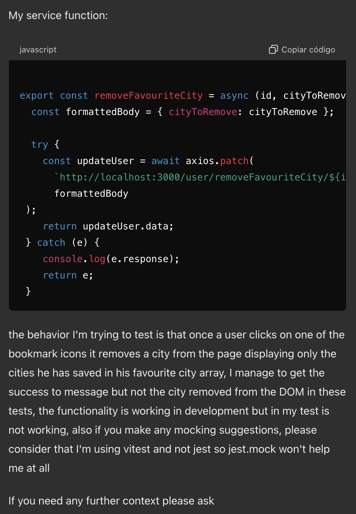

# DF TRAVEL APP FRONT-END

The DF Travel app is a frontend application that enables users to plan their vacations by providing a five-day weather forecast. Users can create an account to save and quickly access their favorite locations. Additionally, users can manage their saved locations by adding or removing cities to keep their favorites up to date.

- [Using the App](#using-the-app)
- [User Stories](#user-stories)
- [Component hierarchy](#component-hierarchy)
- [Further development suggestions](#further-development-suggestions)
- [Known Bugs](#known-bugs)
- [AI usage](#ai-usage)

## Using the app

This app uses the following APIs:

- **OpenCage API**: For geocoding location data.
- **Weather API**: For retrieving weather forecasts.
- **DF Travel Backend API**: For managing user accounts and saved locations.

[back to the top](#df-travel-app-front-end)

### Testing the App Locally

To test the app on your local machine, use the following sample credentials:

- **Email**: john.doe@example.com
  **Password**: JohnPassword1!

- **Email**: michael.jones@example.com
  **Password**: MichaelPass1!

## User Stories

### User Story 1: Sign Up

**As a** user,\
**I want to be able** to sign up for an account,\
**So that I can** create a personal profile and access personalized features.

#### Test plan:

- Check if user gets feedback when register was successful
- Check that user receives feedback if inputs are invalid
- Check if user receives a message saying email already exist if user tries to register with a already in user email
- Should register the user in the database using the services

### User Story 2: Login

**As a** user,\
**I want to be able** to log in to my account,\
**So that I can** access additional features available to registered users.

#### Test plan:

- When login was successful user should see a feedback message
- When login was unsuccessful user should see a feedback message
- Get the user from the services if email and password match with the database

### User Story 3: Search

**As a** user,\
**I want to be able** to search for a location by name,\
**So that I can** see the weather forecast for that location.

#### Test plan:

- When searching for a valid location user should see a menu with all of the options
- When user search for a invalid location user should receive feedback
- Parse the input to retrieve the latitude and longitude of the location
- Retrieve locations from the geocoding api using the services

### User Story 4: Add to Favorites

**As a** user,\
**I want to be able** to add a location to my favorites,\
**So that I can** quickly access the weather forecast for that location later.

#### Test plan:

- When adding a city to the favourites user should receive a feedback message
- User should be updated in the database using the services

### User Story 5: Remove from Favorites

**As a** user,\
**I want to be able** to remove a location from my favorites,\
**So that I can** keep my favorites list up to date with only the locations I care about.

#### Test plan:

- When removing a city successfully user should receive a feedback message
- User should be updated in the database using the services

### User Story 6: Responsiveness

**As a** user,\
**I want to be able** to view and use the application on any device (mobile, tablet, desktop),\
**So that I can** access the weather forecasts conveniently regardless of the device I'm using.

[back to the top](#df-travel-app-front-end)

## Component Hierarchy

[back to the top](#df-travel-app-front-end)

## Further Development Suggestions

### Enhancements to User Authentication and Security

**Potential Benefits:**

- Improved security with token expiration and renewal, reduced risk of session hijacking, and enhanced scalability for large user bases.

**Implementation:**

- Integrate JWT or similar token-based authentication mechanisms into the login and registration processes. Ensure tokens are securely stored and transmitted.

**Potential Risks:**

- Potential implementation complexity, increased overhead for token management, and the need for robust error handling and token validation.

### Enable Users to Change Their Password

**Potential Benefits:**

- Improves user security by allowing password updates.
- Enhances user trust and satisfaction.

**Implementation:**

- Add a "Change Password" option in the user profile settings.
- Implement backend endpoints to handle password updates.
- Include client-side form validation and server-side encryption.

**Potential Risks:**

- Increased risk of security vulnerabilities if not implemented correctly.
- Requires secure handling of user data to prevent breaches.

### Enable Users to Delete Their Account

**Potential Benefits:**

- Provides users control over their data.
- Enhances compliance with data protection regulations.

**Implementation:**

- Add a "Delete Account" option in the user profile settings.
- Implement backend logic to delete user data from the database.
- Confirm user intent with a double opt-in (e.g., confirmation email or modal).

**Potential Risks:**

- Irreversible action leading to potential user regret or accidental deletions.
- Requires careful handling of data deletion to ensure compliance with data protection laws.

### Add Location Map Using TomTom API

**Potential Benefits:**

- Enhances user experience by providing a visual map of the searched location.
- Helps users better understand the geography of their destination.

**Implementation:**

- Integrate the TomTom Maps API to display maps on location search results.
- Use the coordinates from the OpenCage API search to center the map.

**Potential Risks:**

- API costs may increase with higher usage.
- Requires ensuring compatibility and performance optimization for smooth user experience.

### List Hotels for the Location Using Booking API

**Potential Benefits:**

- Provides users with convenient hotel booking options directly within the app.
- Can generate additional revenue through affiliate programs or partnerships.

**Implementation:**

- Integrate the Booking API to fetch and display hotel listings for the searched location.
- Include booking links or in-app booking options.

**Potential Risks:**

- Dependency on external API uptime and reliability.
- Ensuring user data privacy and compliance with Booking API terms of service.

### List Flights for the Location Using Skyscanner API

**Potential Benefits:**

- Provides users with comprehensive travel planning by offering flight options.
- Enhances user engagement and satisfaction by offering a one-stop solution for travel needs.

**Implementation:**

- Integrate the Skyscanner API to fetch and display flight options to the searched location.
- Include booking links or in-app booking options.

**Potential Risks:**

- Dependency on external API uptime and reliability.
- Ensuring user data privacy and compliance with Skyscanner API terms of service.

By incorporating these features and integrations, the DF Travel App may dramatically improve its functionality and user experience, making it a more valuable tool for travelers. However, successful development requires careful assessment of potential risks and proper risk mitigation strategies.

[back to the top](#df-travel-app-front-end)

## Known Bugs

### 1. Weather Data Not Displayed After Page Reload Due to Selected City State Reset

- **Description**: After searching for a city using the search box and selecting a city to view weather details, the selected city state resets to default upon page reload. As a result, the weather data for the previously selected city is not displayed until the user performs a new search for the city.
- **Impact**: This issue disrupts user experience by requiring users to perform additional steps to view weather information after a page reload.
- **Steps to Reproduce**:
  1. Use the search box to search for a city (e.g., "New York").
  2. Select a city from the search results to view weather details (e.g., click on "New York").
  3. Weather information for the selected city is displayed.
  4. Reload the page.
  5. Upon page reload, observe that the selected city state resets to default (e.g., no city selected).
  6. Weather data for the previously selected city is not displayed.
  7. Navigate back to the main page ("/") and search for the city again to view weather details.

---

### 2. App Crashes When Searching for a Country Instead of a City

- **Description**: When users search for a country instead of a city in the search box, the app crashes. The expected default behavior is to search for a city, and searching for a country triggers unexpected behavior leading to a crash.
- **Impact**: This issue disrupts user experience by causing the app to crash, requiring users to manually return to the default state ("/") and perform a city search.
- **Steps to Reproduce**:
  1. In the search box, enter the name of a country (e.g., "France").
  2. Press Enter or click the search button.
  3. The app crashes or displays unexpected behavior.
  4. Navigate back to the main page ("/") to reset the search state.
  5. Perform a city search (e.g., enter "New York" in the search box).
  6. Weather information for the searched city should now be displayed correctly.
- **Potential Fix**: Review the search functionality to ensure it correctly handles input for city names as the default behavior. Implement input validation or error handling to prevent crashes when non-city inputs (such as country names) are entered. Provide clear user feedback or error messages to guide users to search for cities instead of countries.

---

### 3. Page Crashes When Loading Selected City Due to Inconsistent Data from OpenCage API

- **Description**: Sometimes when navigating to a selected city page, the page crashes. This is caused by inconsistent data returned from the OpenCage API, leading to unexpected behavior or errors.
- **Impact**: This issue disrupts user experience by preventing users from accessing weather information for selected cities reliably.
- **Steps to Reproduce**:
  - Navigate to a selected city page (e.g., "/weather/NewYork").
  - Observe that the page crashes or displays unexpected behavior intermittently.
  - The issue may occur due to variations in data returned by the OpenCage API for different locations.
- **Potential Fix**: Review the integration with the OpenCage API to handle variations in data response more robustly. Implement error handling and retry mechanisms for API requests to mitigate crashes caused by inconsistent data. Consider caching strategies or alternative APIs for geocoding to improve reliability in retrieving location data.

[back to the top](#df-travel-app-front-end)

## AI Usage

Asked AI for help in fixing failing tests in FavouriteLocations component:

### Prompt:

### Result:

[back to the top](#df-travel-app-front-end)
