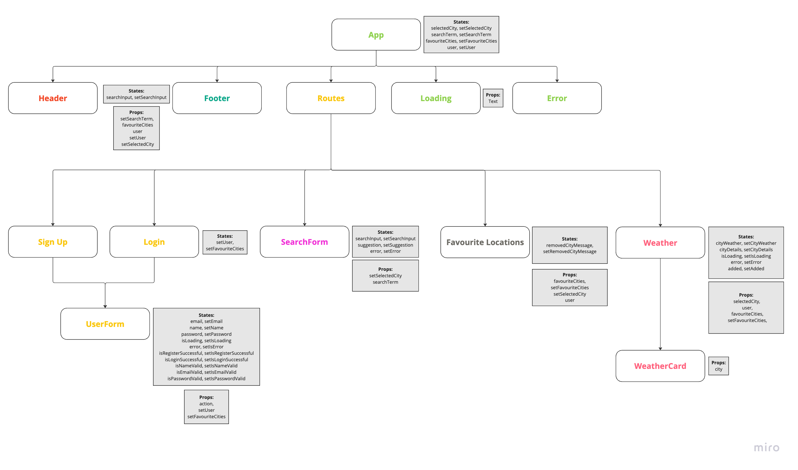

## User Story 1: Sign Up

**As a** user,\
**I want to be able** to sign up for an account,\
**So that I can** create a personal profile and access personalized features.

### Test plan:

- Check if user gets feedback when register was successful
- Check that user receives feedback if inputs are invalid
- Check if user receives a message saying email already exist if user tries to register with a already in user email
- Should register the user in the database using the services

## User Story 2: Login

**As a** user,\
**I want to be able** to log in to my account,\
**So that I can** access additional features available to registered users.

### Test plan:

- When login was successful user should see a feedback message
- When login was unsuccessful user should see a feedback message
- Get the user from the services if email and password match with the database

## User Story 3: Search

**As a** user,\
**I want to be able** to search for a location by name,\
**So that I can** see the weather forecast for that location.

### Test plan:

- When searching for a valid location user should see a menu with all of the options
- When user search for a invalid location user should receive feedback
- Parse the input to retrieve the latitude and longitude of the location
- Retrieve locations from the geocoding api using the services

## User Story 4: Add to Favorites

**As a** user,\
**I want to be able** to add a location to my favorites,\
**So that I can** quickly access the weather forecast for that location later.

### Test plan:

- When adding a city to the favourites user should receive a feedback message
- User should be updated in the database using the services

## User Story 5: Remove from Favorites

**As a** user,\
**I want to be able** to remove a location from my favorites,\
**So that I can** keep my favorites list up to date with only the locations I care about.

### Test plan:

- When removing a city successfully user should receive a feedback message
- User should be updated in the database using the services

## User Story 6: Responsiveness

**As a** user,\
**I want to be able** to view and use the application on any device (mobile, tablet, desktop),\
**So that I can** access the weather forecasts conveniently regardless of the device I'm using.

# Component Hierarchy

